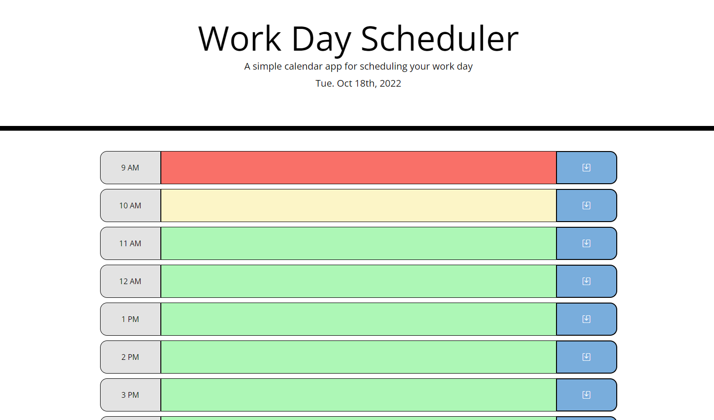
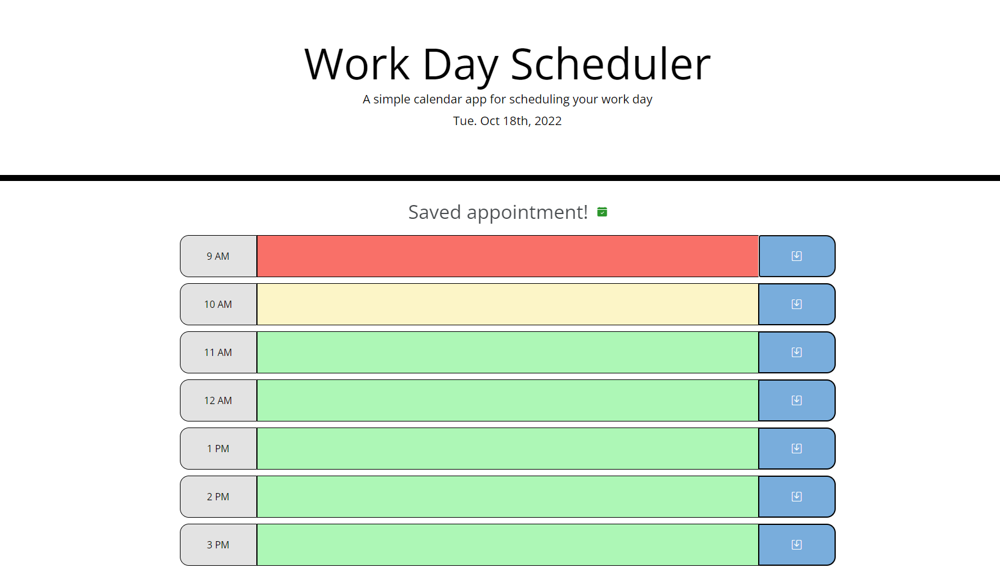

# Work Day Scheduler
## Description
I really wanted a planner for my work day so I made this website. With this website I can type up my work day and save it and it will remain after refreshing the page.

The website loads with a title that says Work Day Scheduler and a caption that says "A simple calendar app for scheduling your work day". Under the caption displays the current date! Under the header is the planner itself. A time slot with the time, a textbox, and a save button will appear for all business hours. The color will change on if the hour is past, present, or future. Clicking the colored box will allow you to type in it. After editing the contents of the box, click the button and it will save the text in the box to your localStorage and a Save notification will display above all the boxes. Reloading the page will display all the timeslots as you had previously saved them.

I learned how to parse a string into a integer with the parseInt method.

I learned how to use moment.js!

I learned how to utilize bootstrap icons more.

I learned how to make buttons interact with textarea values. 

## Installation
This is N/A as it is a webpage and can be run without installing.

## Usage
Click the text area and type out your tasks then click the save button next to the text area to save your appointment for the hour.

Here's the link to the site!: https://fruityokapi.github.io/Work-Day-Scheduler/

## Credits
The starter code is from this repository: https://github.com/coding-boot-camp/super-disco

Bootstrap: https://getbootstrap.com

jQuery: https://api.jquery.com

moment.js: https://momentjs.com

## License
The license is a default MIT license in the LICENSE.md file